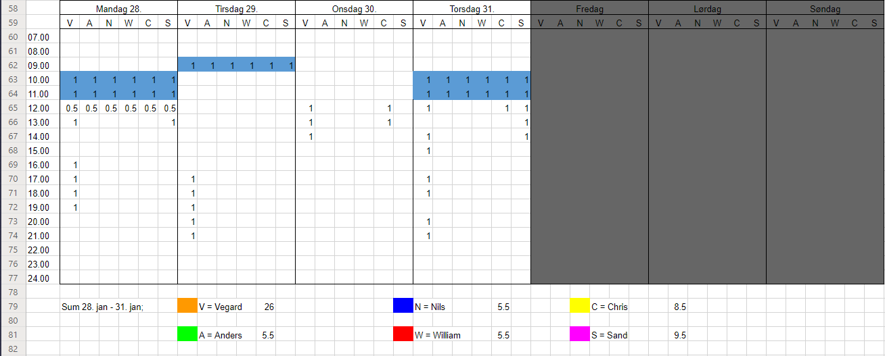
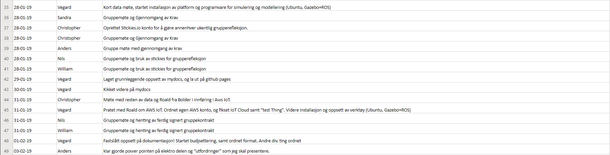

# Weekly documentation (hours, referendums, tasks completed)

# 28/1 to 3/2

Hours

  
  

Log

  

Referendums

Dato: 28/01/19 - Gruppemøte 

Tilstede: Alle 

Hva skjedde i dag?  

    Mail er sendt til både Eirik og Gian angående 1.presentasjon 

    Melding er sendt Gian om han kan få tak i Eirik og bekrefte 1.presentasjon den 8.februar 

    Dokusaurus litt avansert, og gruppa mener det ikke nødvendig å gjøre ting alt for komplisert 

    Sandra har sett på forskjellige Gantt diagram som kan brukes 

    Ila. Møtet bekreftet Eirik 8.februar som presentasjons dag 

    8.februar passet ikke for skolen, og enn oppdatert innkalling er sendt til 11.februar. 

    I dag hadde vi sticky notes brainstorm, hovedsakelig var folk enige om at vi må komme i gang med prosjektet og produktet, samt at vi var en flott gruppe. 

    Screenshot fra sticky notes brainstorm - http://prntscr.com/md6gem 

    Vi vil bruke dette systemet hver 2.uke fra nå av. 

    Fint om man fyller inn kanban kortene med mest mulig informasjon når de lages. 

 

Møte angående 1.presentasjon: 

    Må se på Kanban kort (passe på at vi ikke multi-tasker for mye). 

    Vi setter opp en regel på max 3 aktive tasker per person, dersom du ikke kan fullføre en må den plasseres tilbake i backloggen. 

    Backloggen på prioriteres, slik at de viktigste taskene ligger øverst. 

    Vurderes å sette opp en felles backlog for alle, samt en backlog som er linje spesifikk. 

    Kan sortere etter fargekoding (en farge for en linje) 

    Vi vil fortette med ukentlige møter og forbedre kanban ettersom det trengs 

    En template til 1.presentasjon powerpoint er satt opp 

 

Hva er krav til produktet: 

    Må ha en effektiv dataoverføring 

    Hva er radius til transmittørene 

    Ikke kablet strøm 

    Ikke installasjon fra bakside av vegg (både vanskelig og farlig) 

    Blåtann? Wi-fi? 

    Håndtak min 20cm fra hverandre 

    Registrere fall 

    Kraft sensorer (3D) 

    Må vite hvor på veggen man befinner seg 

    Må ha synlig belysning 

    Må passe til eksisterende klatrevegger 

Planer for neste møte? 

Spørsmål til Henning 

    Til hvilken grad skal vi presentere bedriften? Bør vi fortelle mye om hva de gjør? 

 

Dato og tid for neste møte: 29/01/19 

 

 

 

Dato: 29/01/19 - Møte med Henning - Gruppemøte 

Tilstede: 

Hva skjedde i dag?  

    Ukentlige oppfølgingsdokumenter  

    Og pratet om hva vi bør gjøre på 1. pres  

    Hørte om potensielle fallgruver  

    Fastslo å ha veileder møte hver Torsdag, og gruppe møte hver Onsdag. 

 

Planer for neste møte? 

    Brainstorme ideer for løsning 

    Nytt system på dokumenter – gira mot å levere inn dok ukentlig  

    Fastsatt tidspunkt Torsdag 31-1/2019 kl 1000 

 

Dato og tid for neste møte: Torsdag 31/01/19 kl 10.00 

 

 

 

Dato: 31/01/19 - Gruppemøte 

Tilstede: Alle 

Hva skjedde i dag?  

    Snakket om nettsiden Vegard laget. 

    Planlegge møte med Roald for data. 

    Gantt Diagram 

 

Brainstorm 

    Satt opp krav, 

    Snakket om design av håndtak, ulike deler osv. 

    Snakk om hvilke sensorer vi ønsker å bruke, vil gjerne ha en som sender lokalisjon slik at v kan vite hvor alle håndtakene på veggen er. 

 

Planer for neste møte? 

 

 

 

Dato og tid for neste møte: Mandag 04/02/19 kl. 10.00 